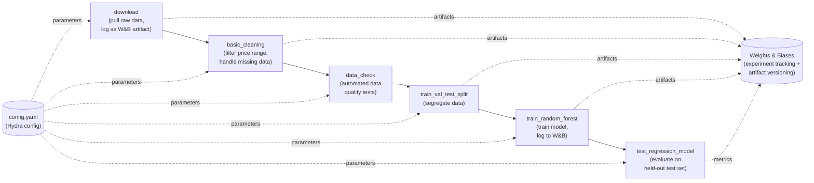

# Build an ML Pipeline for Short-Term Rental Prices in NYC

An end-to-end, reusable machine learning pipeline that estimates fair short-term rental prices in NYC from listing data — built with MLflow, Hydra, and Weights & Biases so it can be re-run automatically as new data arrives.

> **Note:** This is a Udacity MLOps Nanodegree project ("Build an ML Pipeline for Short-Term Rental Prices in NYC," used to fulfill a WGU course requirement), built on top of the official Udacity starter kit. This repository is public because GitHub does not allow forks to be made private independently of their upstream repo — it is not intended as a "copy my homework" resource; if you're taking this course yourself, please do your own work.
>
> Live experiment tracking for this project is available on Weights & Biases: [team_zinn/nyc_airbnb](https://wandb.ai/team_zinn/nyc_airbnb?nw=nwuserrzinndesigns)

---

## Business Problem

A property management company renting rooms and properties on short-term rental platforms needs to estimate a **fair market price** for a given property based on comparable listings. Because the company receives **new data in bulk every week**, a one-off price model trained manually isn't sufficient — pricing accuracy degrades as the market shifts, and retraining by hand doesn't scale.

This project solves both problems at once: it builds a price-estimation model **and** wraps it in a fully reusable, parameterized pipeline that can be re-run end-to-end (or step-by-step) every time new data arrives — without manual intervention or hardcoded assumptions baked into the code.

---

## Dataset

The pipeline ingests NYC short-term rental listing data (in the spirit of the well-known "NYC Airbnb" listings dataset), including fields such as listing price, room type, neighborhood, location (latitude/longitude), minimum nights, and review activity.

**Obtaining the data:** data is **not** stored as a static file in this repo — it's pulled and versioned automatically by the pipeline's `download` step, then tracked as a Weights & Biases artifact at each stage of processing (raw → cleaned → split). This means every dataset version used in a given pipeline run is fully reproducible from the corresponding W&B artifact, rather than relying on a single CSV snapshot.

---

## Technologies Used

- **Python**
- **MLflow** — pipeline orchestration; each pipeline step (`download`, `basic_cleaning`, `data_check`, `train_val_test_split`, `train_random_forest`, `test_regression_model`) is its own MLflow project/component
- **Hydra** — configuration management (`config.yaml`); all pipeline parameters are read from config rather than hardcoded, so the pipeline can be re-parameterized without code changes
- **Weights & Biases (W&B)** — experiment tracking and data/artifact versioning across every pipeline step
- **scikit-learn** — model training (Random Forest regression for price prediction)
- **pandas** — data cleaning and transformation
- **GitHub Actions** — CI (per `.github/workflows`)
- **conda** — environment management (`environment.yml`, `conda.yml`)

---

## Architecture



**Pipeline summary:**
1. **`download`** pulls the raw listing data and logs it as a versioned W&B artifact.
2. **`basic_cleaning`** filters out-of-range prices and handles missing/invalid values, producing a cleaned dataset (also logged to W&B).
3. **`data_check`** runs automated data quality tests against the cleaned data before it's allowed to proceed further in the pipeline — catching schema drift or unexpected values early.
4. **`train_val_test_split`** segregates the cleaned data into training and test sets.
5. **`train_random_forest`** trains a Random Forest regression model on the training data, with hyperparameters controlled entirely via `config.yaml` (e.g. `modeling.random_forest.n_estimators`), and logs the trained model and metrics to W&B.
6. **`test_regression_model`** evaluates the final model against the held-out test set to report real-world expected performance.

Every step's parameters are pulled from `config.yaml` via Hydra rather than hardcoded — this is what makes the pipeline genuinely reusable for new data drops rather than a one-time script.

---

## Setup and Execution

### Prerequisites
- conda
- A [Weights & Biases](https://wandb.ai) account and API key

### Installation

```bash
git clone https://github.com/ZinnNotZen/Project-Build-an-ML-Pipeline-Starter.git
cd Project-Build-an-ML-Pipeline-Starter

conda env create -f environment.yml
conda activate nyc_airbnb_dev
```

### W&B authentication

```bash
wandb login [your API key]
```

### Configuration

All pipeline parameters live in `config.yaml`, read via Hydra. No parameters are hardcoded in the pipeline steps — to change behavior (e.g., model hyperparameters, price filtering bounds), edit `config.yaml` or override via the command line (see below).

### Running the pipeline

Run the full pipeline:
```bash
mlflow run .
```

Run a single step (useful during development):
```bash
mlflow run . -P steps=download
```

Run multiple specific steps:
```bash
mlflow run . -P steps=download,basic_cleaning
```

Override configuration parameters at runtime via Hydra syntax:
```bash
mlflow run . \
  -P steps=download,basic_cleaning \
  -P hydra_options="modeling.random_forest.n_estimators=10 etl.min_price=50"
```

### Troubleshooting

If an `mlflow`-created conda environment becomes corrupted (most often from a `pip` dependency issue), list and clean up environments created by `mlflow`:
```bash
conda info --envs | grep mlflow | cut -f1 -d" "
# Review the list, then remove them:
for e in $(conda info --envs | grep mlflow | cut -f1 -d" "); do conda uninstall --name $e --all -y; done
```

---

## Sample Outputs

All experiment runs, metrics, and artifact versions are tracked live on Weights & Biases: **[team_zinn/nyc_airbnb](https://wandb.ai/team_zinn/nyc_airbnb?nw=nwuserrzinndesigns)**

There you can review, for any given run:
- Data quality check results from the `data_check` step
- Random Forest hyperparameters and training metrics
- Final model performance on the held-out test set
- The full artifact lineage from raw download through to trained model

---

## Key Findings and Lessons Learned

- **Reusability requires discipline, not just code.** The hardest part of this project wasn't training a Random Forest — it was resisting the urge to hardcode parameters during development. Routing every parameter through `config.yaml`/Hydra is what actually makes the pipeline reusable on the next data drop, rather than just a script that happened to work once.
- **Automated data checks catch problems before they become model problems.** Running `data_check` as a discrete pipeline step (rather than skipping straight to training) means schema or data-quality issues surface immediately, with a clear stage to blame — instead of silently degrading model performance downstream.
- **Artifact versioning makes "what data trained this model?" an answerable question.** Logging every intermediate dataset (raw, cleaned, split) to W&B as a versioned artifact means any past model run can be traced back to the exact data that produced it — essential for debugging a pipeline that's meant to run repeatedly on new data.
- **Step-level execution sped up iteration significantly.** Being able to run `mlflow run . -P steps=download,basic_cleaning` instead of the entire pipeline made it possible to iterate quickly on a single step without waiting through the full download → train → test cycle every time.

---

## Possible Extensions

- Add a model comparison step (e.g., Random Forest vs. Gradient Boosting) with automatic selection of the best-performing model based on test metrics
- Add a scheduled trigger (e.g., GitHub Actions cron, or an orchestrator like Airflow/Prefect) so the pipeline genuinely runs automatically on the company's weekly data cadence, rather than being triggered manually
- Build a lightweight API or dashboard on top of the trained model so non-technical stakeholders can query price estimates directly
- Add drift detection comparing each new weekly data batch's distribution to the training data, to catch when retraining is actually warranted versus routine
